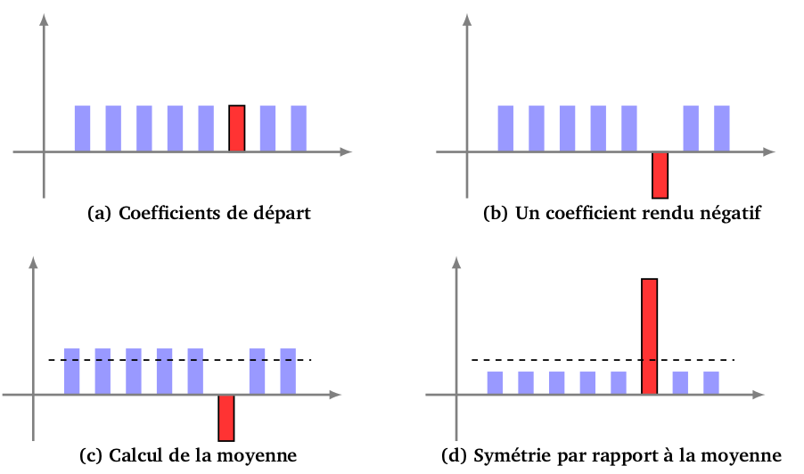

# Algorithme de Recherche Quantique de Grover (Exo 04)

L'algorithme de Grover est le deuxième algorithme quantique majeur qui démontre l'avantage des ordinateurs quantiques sur leurs homologues classiques. Il permet de trouver l'unique élément solution ($\omega$) dans une liste non triée de $N$ éléments avec une complexité en $\mathcal{O}(\sqrt{N})$, contre $\mathcal{O}(N)$ pour la méthode classique.


## I. Contexte et Complexité

| Type de Recherche | Complexité Classique | Complexité Quantique |
| :--- | :--- | :--- |
| **Liste Ordonnée** | $\mathcal{O}(\log_2 N)$ (Dichotomie) | $\mathcal{O}(\log_2 N)$ |
| **Liste Non Ordonnée** | $\mathcal{O}(N)$ (Test un par un) | $\mathcal{O}(\sqrt{N})$ (**Grover**) |

Pour $N=1$ milliard, la recherche classique demande jusqu'à $1$ milliard d'étapes, tandis que Grover n'en demande qu'environ $\sqrt{1 \text{ milliard}} \approx 31\,622$.

## II. Principes Fondamentaux de l'Algorithme



**Figure (a)** : On considère que les hauteurs des rectangles représentent les coefficients d’un qubit : ici il y a 8 coefficients pour l’expression d’un 3-qubit comme somme des 8 états de base:

$[0,0,0],[0,0,1],[0,1,0],[0,1,1],[1,0,0],[1,0,1],[1,1,0],[1,1,1]$

Une mesure de ce qubit ne donnerait aucune information, chacun des rangs s’obtenant avec la même probabilité, car les hauteurs des rectangles sont égales.

On recherche le rang de l'état $[1,0,1]$.

**Figure (b)**. On rend le coefficient du rang qui nous intéresse négatif.

Pour cela on va appliquer une Fonction $f$ définie par : 
Soit $N$ un entier fixé et soit $k_0$ un entier avec $0 ⩽ k_0 ⩽ N − 1$. Définissons alors la fonction $f : \{0, 1, \dots , N − 1\} → \{0, 1\}
par : 

$$
f(k_0)=1~et~f(k) = 0~pour~tout~k \neq k_0
$$

Une mesure de nouveau qubit ne donnerait toujours aucune information, car en valeur absolue les hauteurs des rectangles sont encore égales.

**Figure (c)**. On calcule la moyenne des coefficients

**Figure (d).** On effectue une symétrie par rapport à la moyenne. Les rectangles bleus ont maintenant des hauteurs petites alors que le rectangle rouge a une grande hauteur. Que donne une mesure de ce nouveau
qubit ? Il y a beaucoup plus de chances d’obtenir l’état de base correspondant au rectangle rouge et donc d’obtenir le rang souhaité.

L’algorithme de Grover est l’itération de ce procédé : à partir du dernier état obtenu avant mesure, on
recommence les étapes (b), (c) et (d). Le rectangle rouge devient de plus en plus grand et les rectangles bleus
de plus en plus petits. Ainsi après plusieurs itérations, une mesure donne avec une très forte probabilité, le
rang du rectangle rouge.

Une seule itération de Grover ($\mathbf{G}$) est composée de deux parties principales :
$$\mathbf{G} = \mathbf{D} \cdot \mathbf{U}_\omega$$

1.  **$\mathbf{U}_\omega$ (L'Oracle) :** Inverse la phase de l'état solution.
2.  **$\mathbf{D}$ (Le Diffuseur) :** Symétrie par rapport à l'état initial de superposition ($\left|s\right\rangle$).

Ces deux symétries combinées produisent une rotation qui **amplifie l'amplitude de la solution** à chaque étape. 

---

## III. Les Étapes de l'Algorithme

Nous allons illustrer les étapes avec l'exemple de l'exercice : **$N=3$ qubits**, soit $N=2^3=8$ états possibles. La solution recherchée est $|\omega\rangle = |111\rangle$. Le nombre optimal d'itérations est $k_{opt} \approx \frac{\pi}{4} \sqrt{N} = \frac{\pi}{4} \sqrt{8} \approx 1,57$, que l'on arrondit à $k=2$ itérations.

### 1. 📢 Initialisation des États Quantiques (Superposition)

L'initialisation correspond à l'application d'une porte **Hadamard ($\mathbf{H}$)** sur chaque qubit.

* **Objectif :** Placer tous les états dans une superposition égale, appelée état $\left|s\right\rangle$.
* **Porte utilisée :** $\mathbf{H}^{\otimes n}$ (Hadamard sur chaque qubit).
* **Calcul sur 3 Qubits :**
    $$\left|s\right\rangle = \mathbf{H}^{\otimes 3} \left|000\right\rangle = \frac{1}{\sqrt{8}} \sum_{x=0}^{7} \left|x\right\rangle$$
* **Amplitude initiale :** Chaque état possède une amplitude de $\frac{1}{\sqrt{8}} \approx 0,35$ (et donc une probabilité de $1/8$, soit 12,5%, d'être mesuré).

### 2. 🔮 L'Oracle de Phase ($\mathbf{U}_\omega$)

* **Rôle :** L'Oracle est la "boîte noire" qui connaît la solution $|\omega\rangle$. Il ne change pas l'état, mais applique un **changement de phase** de $-1$ uniquement à l'état solution.
* **Opération :** $\mathbf{U}_\omega \left|x\right\rangle = (-1)^{f(x)} \left|x\right\rangle$
    * Si $\left|x\right\rangle \neq \left|111\right\rangle$, amplitude $\to$ *inchangée*.
    * Si $\left|x\right\rangle = \left|111\right\rangle$, amplitude $\to$ *inversée* (multipliée par $-1$).
* **Portes utilisées :** Pour marquer l'état $\left|111\right\rangle$, on utilise une porte **Multi-Controlled Z ($\mathbf{MCZ}$)**, qui est implémentée en Qiskit par :
    $$\mathbf{MCZ} = \mathbf{H} \cdot \mathbf{MCX} \cdot \mathbf{H}$$
    (Pour marquer un état autre que $\left|11\dots 1\right\rangle$, on encadre le $\mathbf{MCZ}$ par des portes **X** sur les qubits à $0$).

Prenons l'exemple :

    ∣ω⟩=∣101⟩ (Index 5) : L'état recherché.

    ∣x⟩=∣011⟩ (Index 3) : Un état qui n'est pas recherché.

L'Oracle est construit sur 3 qubits (q2​,q1​,q0​) et recherche l'état ∣101⟩.

Le circuit de l'Oracle de Phase Uω​ est divisé en trois étapes pour marquer l'état ∣101⟩ à l'aide d'un MCZ (Multi-Controlled Z) sur tous les qubits.

**I. Étape 1 :** Le Mapping (Préparation par X)

Cette étape consiste à appliquer une porte X (NOT) à tous les qubits qui devraient être à ∣0⟩ dans la solution. Seul le qubit q1​ est à ∣0⟩ dans ∣101⟩.

| État initial ∣x2​x1​x0​⟩ | Action (X sur q1​) | État Intermédiaire | Phase | Statut |
| :--- | :---: | :---: | :---: | :---: |
| $∣1.0.1⟩$ (Solution) | X sur q1​ | ∣111⟩ | +1 | Transformé en 111 |
| $∣0.1.1⟩$ (Non-Solution) | X sur q1​ | ∣001⟩ | +1 | Différent de 111 |

**II. Étape 2 :** Le Flip de Phase (MCZ)

Le MCZ applique une phase de −1 uniquement si l'état est ∣11…1⟩.

|État Intermédiaire | Action (MCZ sur q2​,q1​,q0​) | État après MCZ | 
| :----------------: | :------------------------ | :-------------: |
|**$∣111⟩$** (Ex-solution)|Applique −1|$- \|111⟩$| |
|$∣001⟩$ (Ex-non-solution)|Applique +1|$+\|001\rangle$|

**III. Étape 3 :** L'Annulation (Nettoyage par X)

Nous annulons l'opération de mapping en appliquant à nouveau X sur q1​. La phase est conservée.

| État après Étape 2 | X sur q1​ | Résultat Final $U_ω​∣x⟩$ | Conclusion |
| :--- | :--- | :--- | :--- |
| **$−∣111⟩$** | X sur q1​ | $−∣101⟩$ | Marqué (phase inversée) |
| $+∣001⟩$ | X sur q1​ | $+∣011⟩$ | Non-marqué (phase inchangée) |

#### Rappel *L'inversion de phase d'un État quantique*

Un seul qubit est décrit par l'état de superposition suivant :

$$
∣\psi\rangle = \alpha∣0\rangle + \beta∣1\rangle
$$

Où $\alpha$ et $\beta$ sont des nombres complexes, et $∣\alpha∣^2+∣\beta∣^2=1$.

L’inversion de phase est le changement de $\alpha |0\rangle + \beta |1\rangle$ en $\alpha |0\rangle − \beta |1\rangle$.
Le changement de phase correspond à une porte **Z**.

La séquence **H⋅MCX⋅H** est l'équivalent parfait de la porte **MCZ**, qui inverse la phase de $−1$ uniquement lorsque l'état de tout le registre de données est $∣111\rangle$.

Dans notre exemple de recherche de l'état $[1,0,1]$ voici le schémat de l'Oracle : 

```text
q0:  |0>──────────■───────
          ┌───┐   │   ┌───┐
q1:  |0>──┤ X ├───■───┤ X ├───
          ├───┤ ┌─┴─┐ ├───┤
q2:  |0>──┤ H ├─┤ X ├─┤ H ├───
          └───┘ └───┘ └───┘
```
Ce circuit peut être décomposé en trois blocs logiques, correspondant exactement aux trois étapes théoriques vues précédemment :

**Bloc 1 : Le Mapping (Portes X)**

| Qubit | Porte | Rôle dans la recherche de ∣101⟩ |
| :---: | :---: | :--- |
| q1​ | X (à gauche) | Transforme le ∣0⟩ de ∣101⟩ en ∣1⟩. |

**Bloc 2 : Le MCZ (Multi-Controlled Z)**

Le cœur du circuit est la séquence des trois portes au milieu : **H** sur $q_2$​, **MCX** (*Toffoli généralisé*) sur $q_0​,q_1 ​→q_2$​, puis **H** sur $q_2$​.

| Qubit | Porte | Rôle dans l'inversion de phase |
| :---: | :---: | :----------------------------- |
| $q_2$ ​| **H** | Place le qubit cible $q_2$​ dans un état de superposition nécessaire pour transformer l'opération **MCX** en opération de phase **MCZ**.|
| $q_2$​ | **MCX (cible)** | Inverse $q_2$​ (En appliquant **X**) uniquement si $q_0$​ ET $q_1$​ sont **$\|1\rangle$** ^[1]|
|$q_2$​ |**H**|Inverse la transformation **H**.|

^[1]: Puisque $q_2$​ était en superposition après le premier H, cette porte **MCX** crée l'effet de phase.

### 3. L'Opérateur de Diffusion (Le Diffuseur $\mathbf{D}$)

Maintenant que *l'Oracle* a inversé la phase de l'amplitude de l'état solution ($∣101\rangle$), nous passons à la deuxième partie de l'itération de Grover : **le Diffuseur (D)**, dont le rôle est de convertir cette inversion de phase en une augmentation de probabilité mesurable.

* **Rôle :** Le Diffuseur est parfois appelé *l'Opérateur d'Amplification de l'Amplitude* (Amplitude Amplification). Son action est une symétrie par rapport à l'état initial de superposition, $∣S\rangle$.


**1 L'Effet sur les Amplitudes**

Le Diffuseur **$\mathbf{D}$** effectue mathématiquement une seule opération sur toutes les amplitudes : il inverse l'amplitude de chaque état par rapport à l'amplitude moyenne ($\mu$) du registre.

$$Nouvelle ~ amplitude(x)=2 \times \mu − Ancienne ~ amplitude(x)$$

Rappel du Contexte (pour 3 qubits, $N=8$ **états**)


* Amplitude initiale (avant Oracle) : $\frac{1}{\sqrt{8}} \approx +0.35$ pour tous les états.

* Amplitude moyenne ($\mu$) : Elle est encore très proche de $\frac{1}{\sqrt{8}}$​ (puisque seule l'amplitude de la solution a été inversée en $−0.35$, ce qui ne change presque pas la moyenne).

**2. Application aux Deux États**

Nous allons voir comment le Diffuseur (**$\mathbf{D}$**) affecte la solution recherchée et marquée (**$−∣1.0.1\rangle$**) et un état non-marqué (** $+∣0.1.1\rangle$ **).

**a. Effet sur la solution $|1.0.1\rangle$ :**

L'amplitude de la solution était négative suite à l'Oracle ($−\frac{1}{\sqrt{8}}$​).

$$
\begin{matrix}Nouvelle~Amplitude~(|1.0.1\rangle) & = & 2 \times \frac{1}{\sqrt{8}} - (- \frac{1}{\sqrt{8}}) \\
& = & \frac{2}{\sqrt{8}} + \frac{1}{\sqrt{8}} \\
& = & + \frac{3}{\sqrt{8}} \\
& \approx & +1.06
\end{matrix}
$$

* Résultat : en une seule itération, l'Amplitude est passée de $-0.35$  à **$+1.06$** , **trois fois** plus grande !

**b. Effet sur $|0.1.1\rangle$ :**

L'amplitude des états non-solutions était positive et non-marquée ($+ \frac{1}{\sqrt{8}} $​).

$$
\begin{matrix}
Nouvelle ~ Amplitude & = 2 \times \frac{1}{\sqrt{8}} - (+ \frac{1}{\sqrt{8}}) \\
& = \frac{2}{\sqrt{8}} - \frac{1}{\sqrt{8}} \\
& = + \frac{1}{\sqrt{8}} 
\end{matrix}
$$

* Résultat : L'amplitude des non-solutions est revenue à l'amplitude moyenne initiale, soit $0.35$ (et même légèrement diminuée après avoir normalisé l'état total, car l'amplitude de la solution a dépassé 1).

**Conclusion** : Le Diffuseur a réussi à amplifier l'amplitude de la solution marquée, tout en réduisant l'amplitude des non-solutions.

**3. Circuit du Diffuseur $\mathbf{D}$ :**

```text
          ┌───┐┌───┐          ┌───┐┌───┐     
q_0: |0>──┤ H ├┤ X ├───────■──┤ X ├┤ H ├─────
          ├───┤├───┤       │  ├───┤├───┤     
q_1: |0>──┤ H ├┤ X ├───────■──┤ X ├┤ H ├─────
          ├───┤├───┤┌───┐┌─┴─┐├───┤├───┤┌───┐
q_2: |0>──┤ H ├┤ X ├┤ H ├┤ X ├┤ H ├┤ X ├┤ H ├
          └───┘└───┘└───┘└───┘└───┘└───┘└───┘
```

**À noter que le Diffuseur est toujours le même pour tous les Oracles de recherche de Grover pour un nombre $N$ de qubits donné.**

**1. Justification de la Formule et du Circuit**

Le Diffuseur $D$ est défini mathématiquement comme une symétrie par rapport à l'état de superposition initiale $∣s\rangle$. il est souvent implémenté dans les circuits quantiques en utilisant la porte Multi-Controlled Z autour de l'état **$∣00\dots0⟩$ **:

$$
D=H^{\otimes N}U_0​H^{\otimes N}
$$
Où $U_0$​ est l'Oracle de phase qui inverse la phase de **seulement l'état $∣00\dots0\rangle$.**

|Bloc|Porte|Rôle dans l'algorithme|
| :-----------:|:----------------------:|:--------------------|
|$H^{\otimes N}$ (Gauche)|Hadamard (**$H$**) appliqué à chaque qubit du registre ($N$ fois).|Ce premier bloc d'Hadamard transforme l'opération d'inversion de phase (qui agit sur l'axe $\|00 \dots 0\rangle $ ) en une opération d'inversion d'amplitude (symétrie), réalisant la première moitié de la rotation.|
|$U_0$​ (Milieu)|**$X^{\otimes N} \cdot MCZ \cdot X^{\otimes N}$**| C'est la partie de l'opérateur qui réalise la symétrie d'axe autour de l'état $\|00\dots 0\rangle$ en inversant la phase de cet unique état.|
|$H^{\otimes N}$ (Droite)|Hadamard (**$H$**) appliqué à chaque qubit du registre ($N$ fois).|Ce deuxième bloc d'Hadamard est l'inverse (et la fin) de la première séquence d'Hadamard. Il annule l'effet de la première $H^{\otimes N}$, finalisant ainsi l'opérateur $D$ qui est, géométriquement, une symétrie autour de l'état de superposition initial $\|s\rangle$.|

**Conclusion** : La combinaison de ces trois blocs effectue la symétrie qui amplifie l'amplitude de l'état solution (dont la phase a été inversée par l'Oracle) et la fait ressortir du registre.